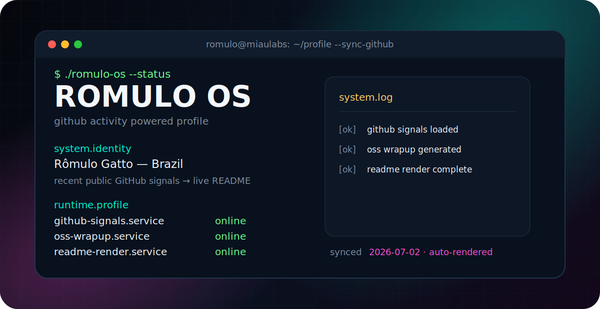

<p align="center">
  
</p>

```console
romulo@miaulabs:~$ whoami
Rômulo Gatto — Brazilian full-cycle engineer building useful software where product, ops, infra, and AI meet.

romulo@miaulabs:~$ mission
Ship practical systems. Automate the boring parts. Keep the stack understandable enough to fix at 3AM.
```

## ./current-focus

```yaml
source: github_public_activity
generated_at: 2026-07-01T04:12:14.556Z
working_on:
  - securo: Open-source personal finance manager. Self-hosted, privacy-first.
  - monoscope: Monoscope lets you ingest and explore your logs, traces and metrics. We sto…
  - callytics: recent GitHub activity

operating_mode:
  - read live signals from recent repos, pushes and pull requests
  - ask a low-temperature free-tier LLM for a concise wrapup when available
  - fall back to deterministic repo scoring when AI is unavailable
  - rebuild this profile automatically through GitHub Actions
```

## ./active-github

| repo | latest signal | why it shows up | stack |
| --- | --- | --- | --- |
| [securo-finance/securo](https://github.com/securo-finance/securo) | issuecomment · 2026-07-01 | Open-source personal finance manager. Self-hosted, privacy-first. | Python · expense-tracker · finance-management |
| [monoscope-tech/monoscope](https://github.com/monoscope-tech/monoscope) | issuecomment · 2026-06-29 | Monoscope lets you ingest and explore your logs, traces and metrics. We store these in S3 c… | Haskell · haskell · logs |
| [rayanweragala/callytics](https://github.com/rayanweragala/callytics) | starred · 2026-06-30 | recent GitHub activity | TypeScript · asterisk-pbx · pjsip |

## ./systems-i-like-building

| system | what I care about |
| --- | --- |
| Product automation | turning messy manual workflows into tools that people actually use |
| AI agents | practical copilots, sidecars, pipelines and decision loops — not demos for demo's sake |
| Video/content engines | generative media workflows, captions, social-first outputs and repeatable production systems |
| Backend platforms | APIs, queues, databases, integrations, billing-ish glue and operational surfaces |
| Homelab / infra | Docker, Linux, networking, monitoring, backups and self-hosted services that stay up |

## ./toolbox

```txt
languages       python · typescript/javascript · go · shell
backend         fastapi · node · postgres · sqlite · redis-ish queues · rest/graphql
frontend        react · next-ish stacks · dashboards · internal tools
infra           docker · github actions · linux · reverse proxies · dns · observability
ai/media        agents · workflow orchestration · video generation · automation glue
product         scoping · shipping · ops thinking · making weird ideas usable
```

## ./selected-links

```console
$ open linkedin
https://linkedin.com/in/romulogatto

$ open github
https://github.com/RomuloGatto

$ mail --compose
mailto:romulo.gatto@gmail.com
```

## ./status

```txt
availability: building, experimenting, automating
location:     Brazil
bias:         small teams, fast loops, real users, working software
```

---

<p align="center">
  <samp>ROMULO OS · synced from GitHub · build &gt; automate &gt; repeat</samp>
</p>
